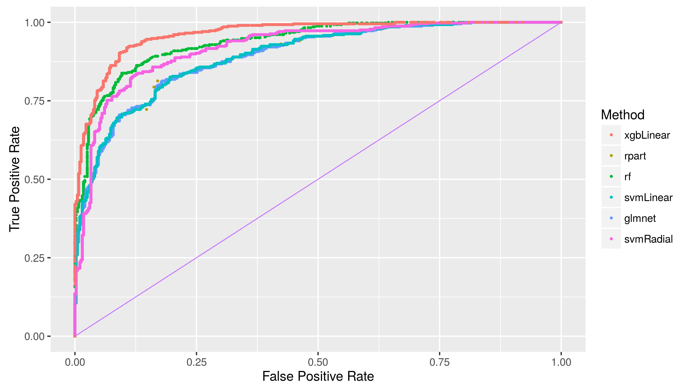

## eSport is BIG {.flexbox .vcenter}


<br>Championship watched by 36 million people in 2015.

<!-- http://www.lazygamer.net/genre/moba/viewership-2015-league-legends-world-championship-toppled-riots-expectations/ 

First place gets $1,000,000.00
http://www.esportsearnings.com/tournaments/15149-lol-2015-world-championship

27 million people play the game daily
concurrent players peak at 7.5M.
67 million players play the game every month.
http://www.inquisitr.com/1847992/league-of-legends-continues-streak-as-most-played-pc-game/

Harvard cheating in similar game...
http://www.usatoday.com/story/tech/gaming/2016/03/27/harvard-team-caught-cheating-heroes-dorm-event/82320786/
-->

## Multiplayer Online Battle Arena {.flexbox .vcenter}


<br>Teams compete to destroy each other's castle.

## API


## Event progression in typical game {.flexbox .vcenter}


## Activity on map {.flexbox .vcenter}


<br>First 20 minutes.

## Activity on map {.flexbox .vcenter}


<br>5-min time slices.

## Strategy? {.flexbox .vcenter}


## Predictions based on objectives {.flexbox .vcenter}


## Questions?

<p style="position:absolute;bottom:5%;right:15%;width:200px;">GitHub.com/<strong>VincentQB</strong></p>

<!--
Applications
-- Betting
-- Balancing team levels
-->

## World Championship Highlight

<iframe width="450" height="250" src="https://www.youtube.com/embed/dFgB286-QVQ?t=2s" frameborder="0" allowfullscreen></iframe>
<br>Quarter final 2015: Baron and Pentakill

## Experience and Gold {.flexbox .vcenter}


## Predictions based on objectives {.flexbox .vcenter}



## Activity on map {.flexbox .vcenter}

```{r, echo = FALSE, message = FALSE}
library(ggplot2)
library(png)
library(grid)
library(dplyr)
library(stringr)
library(shiny)
```

```{r, echo = FALSE}
# Get background image and data frame
img <- readPNG("data/minimap-mh.png")
g <- rasterGrob(img, interpolate = TRUE, width = unit(1,"npc"), height = unit(1,"npc"))
coord <- read.csv("data/map.csv")
maxTime <- floor(max(coord$timestamp))

# Extract gg color
gg_color_hue <- function(n) {
  hues = seq(15, 375, length=n+1)
  hcl(h=hues, l=65, c=100)[1:n]
}

gg_blue <- gg_color_hue(4)[3] # blue: #00BFC4
gg_red  <- gg_color_hue(4)[1] # red: F8766D
gg_purple <- gg_color_hue(4)[4]

make_map <- function(data, density = TRUE) {
  
  # Get background image
  img <- readPNG("data/minimap-mh-alpha.png")
  g <- rasterGrob(img, interpolate = TRUE, width = unit(1,"npc"), height = unit(1,"npc"))
  
  # Scatter plot with background
  p <- data %>%
    ggplot(aes(X, Y, color = factor(teamId), group = factor(teamId))) + 
    scale_color_manual(na.value = "black", values = c(gg_blue, gg_red)) +
    annotation_custom(g, xmin = 0, xmax = 512, ymin = 0, ymax = 512) +
    expand_limits(x = c(0,512), y = c(0,512))
  
  # p <- p + geom_point(alpha = 0.1, size = 1)
  # p <- p + stat_density2d(aes(fill = ..level..), geom = "polygon", alpha = 0.2)
  # p <- p + stat_density2d(aes(alpha = ..level..))
  
  if (density == TRUE) {
    p <- p + stat_density2d(size = 0.5)
  } else {
    p <- p + geom_point(alpha = 0.1, size = 1) 
  }
  
  # Remove padding and decorations
  p <- p +
    scale_y_continuous(expand = c(0,0)) + 
    scale_x_continuous(expand = c(0,0)) +
    theme(aspect.ratio = 1) +
    theme(axis.line = element_blank(),
          axis.text.x = element_blank(),
          axis.text.y = element_blank(),
          axis.ticks = element_blank(),
          axis.title.x = element_blank(),
          axis.title.y = element_blank(),
          legend.position = "none",
          panel.background = element_blank(),
          panel.border = element_blank(),
          panel.grid.major = element_blank(),
          panel.grid.minor = element_blank(),
          plot.background = element_blank())
}

shinyUI(fluidPage(sidebarLayout(
sidebarPanel(
selectInput("eventTypeMap", NULL, 
            c("All", str_replace_all(unique(as.character(coord$eventType)), "_", " ")), 
            selected = "CHAMPION KILL"),
selectInput("team", NULL, 
            c("All", "BLUE WINS", "RED WINS"),
            selected = "RED WINS"),
sliderInput("timeRange", label = "Time", 
            min = 0, max = maxTime, step = 5, value = c(0, 5),
            animate = animationOptions(interval = 2000, loop = T))
),
mainPanel(
renderPlot({

      data <- coord
      
      if (input$eventTypeMap != "All") {
                data <- dplyr::filter(data, eventType == 
                                        str_replace_all(input$eventTypeMap, " ", "_"))
      }
      
      if (input$team == "BLUE WINS") {
        data <- dplyr::filter(data, (teamId == 100 & winner == TRUE) | 
                                    (teamId == 200 & winner == FALSE))
      } else if (input$team == "RED WINS") {
        data <- dplyr::filter(data, (teamId == 100 & winner == FALSE) | 
                                    (teamId == 200 & winner == TRUE))
      }
      
      
      timeslice <- input$timeRange
      data <- dplyr::filter(data, timeslice[1] < timestamp & timestamp < timeslice[2])
      
      p <- make_map(data, !(input$eventTypeMap == "ELITE MONSTER KILL"))
      print(p)

  })
)
)))
```

## Activity in time

```{r, echo = FALSE}
events <- read.csv("data/events.csv")

shinyUI(fluidPage(
fluidRow(
column(8, selectInput("eventTypeTime", NULL, 
                      c("All", 
                        str_replace_all(unique(as.character(events$eventType)), "_", " ")), 
                      selected = "ELITE MONSTER KILL"))
),
fluidRow(
renderPlot({
    
    data <- events
    
    if (input$eventTypeTime != "All") {
        data <- dplyr::filter(data, eventType ==
                                str_replace_all(input$eventTypeTime, " ", "_"))
    }

    # draw the histogram with the specified number of bins
    p <- ggplot(data, aes(timestamp, y = ..count.., 
                          group = winner, fill = winner)) + 
      xlab("minutes") +
      stat_bin(binwidth = 5, alpha = 0.3, 
               col = I("white"), position = "identity")
 
    plot(p)

  })
)
))
```
