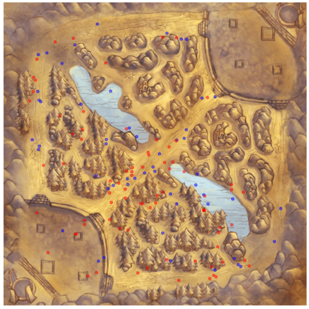

## eSport is BIG {.flexbox .vcenter}


<br>Championship watched by 36 millions people in 2015.

<!-- http://www.lazygamer.net/genre/moba/viewership-2015-league-legends-world-championship-toppled-riots-expectations/ -->

## Multiplayer Online Battle Arena {.flexbox .vcenter}


<br>Teams compete to destroy each other's castle.

## Event Progression in Typical Game {.flexbox .vcenter}


## Strategy? {.flexbox .vcenter}


## Predictions based on objectives {.flexbox .vcenter}


## Questions?


## Map Activity {.flexbox .vcenter}



## Map

```{r, echo = FALSE, message = FALSE}
library(ggplot2)
library(png)
library(grid)
library(dplyr)
library(shiny)
```

```{r, echo = FALSE}
# Get background image and data frame
img <- readPNG("data/minimap-mh.png")
g <- rasterGrob(img, interpolate = TRUE, width = unit(1,"npc"), height = unit(1,"npc"))
coord <- read.csv("data/map.csv")

make_map <- function(data, density = TRUE) {
  
  # Get background image
  img <- readPNG("data/minimap-mh-alpha.png")
  g <- rasterGrob(img, interpolate = TRUE, width = unit(1,"npc"), height = unit(1,"npc"))
  
  # Scatter plot with background
  p <- data %>%
    ggplot(aes(X, Y, color = factor(teamId), group = factor(teamId))) + 
    scale_color_manual(na.value = "black", values = c("blue","red")) +
    annotation_custom(g, xmin = 0, xmax = 512, ymin = 0, ymax = 512) +
    expand_limits(x = c(0,512), y = c(0,512))
  
  # p <- p + geom_point(alpha = 0.1, size = 1)
  # p <- p + stat_density2d(aes(fill = ..level..), geom = "polygon", alpha = 0.2)
  # p <- p + stat_density2d(aes(alpha = ..level..))
  
  if (density == TRUE) {
    p <- p + stat_density2d()
  } else {
    p <- p + geom_point(alpha = 0.1, size = 1) 
  }
  
  # Remove padding and decorations
  p <- p +
    scale_y_continuous(expand = c(0,0)) + 
    scale_x_continuous(expand = c(0,0)) +
    theme(aspect.ratio = 1) +
    theme(axis.line = element_blank(),
          axis.text.x = element_blank(),
          axis.text.y = element_blank(),
          axis.ticks = element_blank(),
          axis.title.x = element_blank(),
          axis.title.y = element_blank(),
          legend.position = "none",
          panel.background = element_blank(),
          panel.border = element_blank(),
          panel.grid.major = element_blank(),
          panel.grid.minor = element_blank(),
          plot.background = element_blank())
}

shinyUI(fluidPage(
fluidRow(
column(6, selectInput("eventType", NULL, 
                      c("All", unique(as.character(coord$eventType))), 
                      selected = "CHAMPION_KILL")),
column(3, selectInput("team", NULL, 
                      c("All", "Blue Wins", "Red Wins"),
                      selected = "Blue Wins"))
),
fluidRow(
renderPlot({

      data <- coord
      
      if (input$eventType != "All") {
        data <- dplyr::filter(data, eventType == input$eventType)
      }
      
      if (input$team == "Blue Wins") {
        data <- dplyr::filter(data, (teamId == 100 & winner == TRUE) | 
                                    (teamId == 200 & winner == FALSE))
      } else if (input$team == "Red Wins") {
        data <- dplyr::filter(data, (teamId == 100 & winner == FALSE) | 
                                    (teamId == 200 & winner == TRUE))
      }

      p <- make_map(data, !(input$eventType == "ELITE_MONSTER_KILL"))
      print(p)

  })
)
))
```