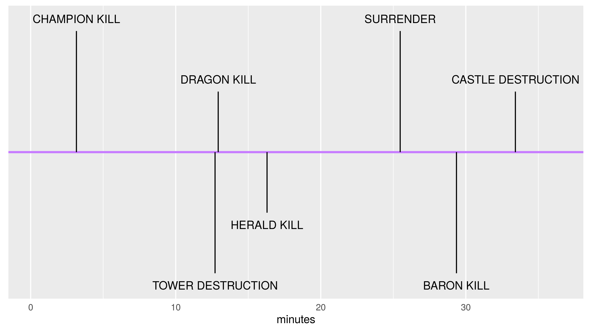

## eSport is BIG {.flexbox .vcenter}

 Championship watched by 36 millions people in 2015.

<!-- http://www.lazygamer.net/genre/moba/viewership-2015-league-legends-world-championship-toppled-riots-expectations/ -->

## Multiplayer Online Battle Arena {.flexbox .vcenter}

 Teams compete to destroy each other's castle.

## Event Progression in Typical Game {.flexbox .vcenter}

## Winning given objective?

## Prediction from objectives

## Questions?

## Map Activity {.flexbox .vcenter}

