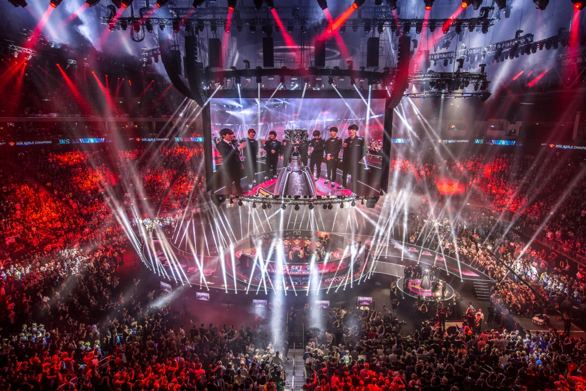

Competitive video games, known as eSports, are becoming big, and League of Legends (LoL) is a leading example. In 2015, the worldwide championship was watched by 36 million people -- and the winning team netted one million dollars. On a daily basis, the game has 27 million unique players with a concurrent players peak of over seven millions. eSport is big.

LoL is in the category of Multiplayer Online Battle Arena (MOBA) games, i.e. video games played online and featuring teams fighting each other. In a match of LoL, two teams of five players compete to destroy each other's castle. Each player controls a character, called champion, with various abilities, while achieving high levels of experience and gaining gold allowing further development of the champion during a match. A team then hopes to develop more quickly to gain the upper hand to destroy the other team's defense and eventually castle.

Below, we present an analysis of games played in order to understand features that enable prediction of the winning team while the game progresses. This can be applied to ensuring fairness of the two teams' composition and development. This can also be applied to betting as the game unfold.

The data was obtained through an API provided by LoL's parent company. It is given in the form of deeply nested JSON format, which can be access through a package called tidyjson. Fortunately, some documentation is provided in order to help navigate the JSON. However, not all the information advertised is in fact available.

## Timeline

A typical game unfolds as follows. Early in a match, a team will succeed in killing a champion from the other team. A kill means that the target champion will be removed from the match for a certain amount of time, and then returned. There are also three neutral objective that can be killed: the dragon, the herald, and the baron. Trying to take one of them puts the team at risk, but gives a bonus helping to gain the upper hand. 

The first tower destruction usually happens very close to the killing of the dragon for the first time. A typical strategy is to push and destroy a tower, and then go for the dragon while the other team scrambles to defend itself. Another strategy is to secretly kill the dragon, and then use its bonus to push to a nearby tower.

The baron gives a large bonus, and so is usually happening close to the final push to destroy the other castle. At that point the match is well advanced, and a team that would have felt unable to win would have surrendered. However, only in long matches do champions reach their maximal levels. The timeline below shows the median time for the first of each event discussed.

Unfortunately, the API does not provide whether a match ended with a surrender. However, if a match ended without the two towers defending the castle as not destroyed, it is possible to conclude that the match must have ended by a team surrendering. This is how we flagged each match as ended in surrender or not.