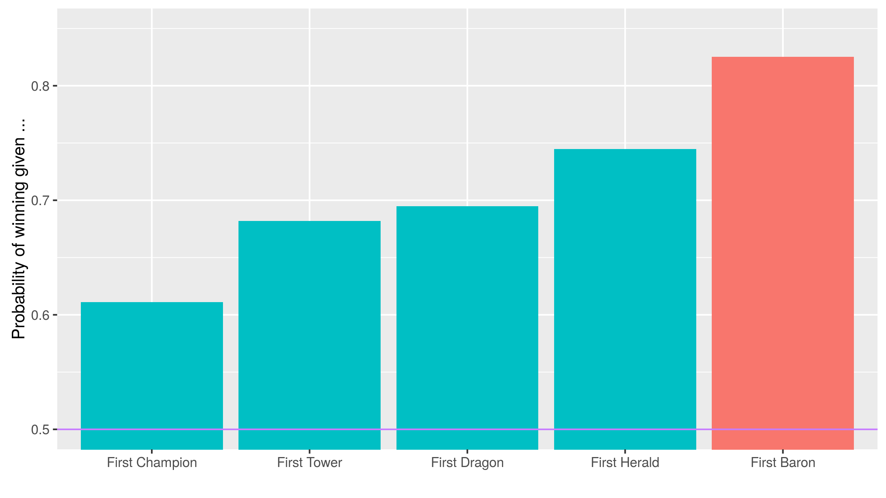
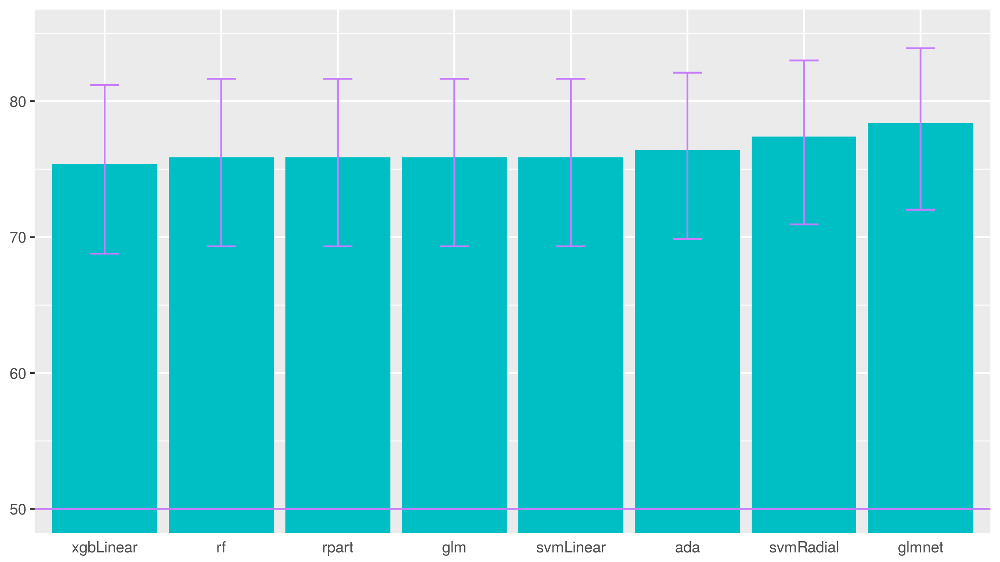
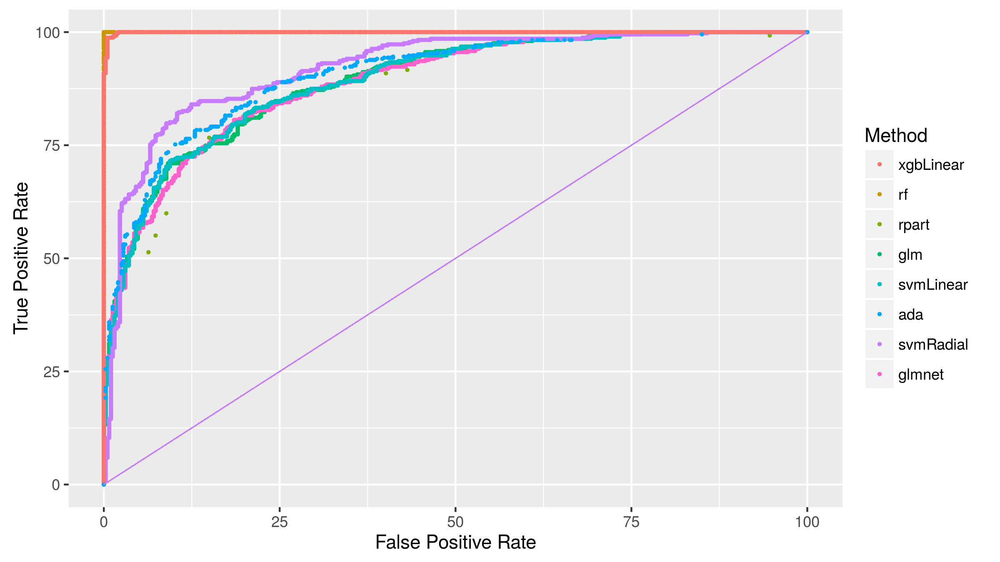
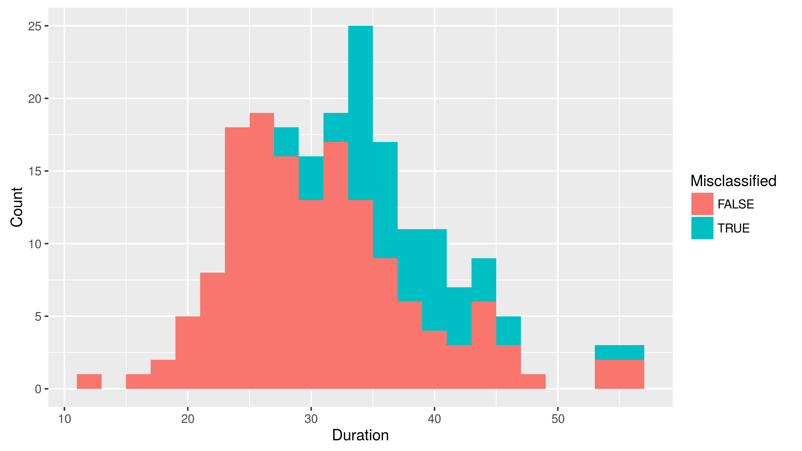
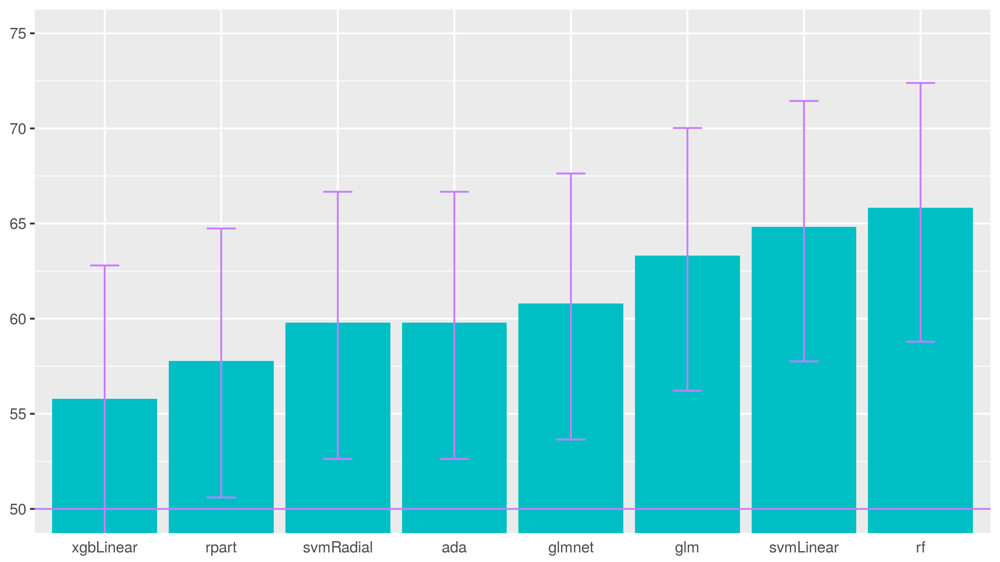
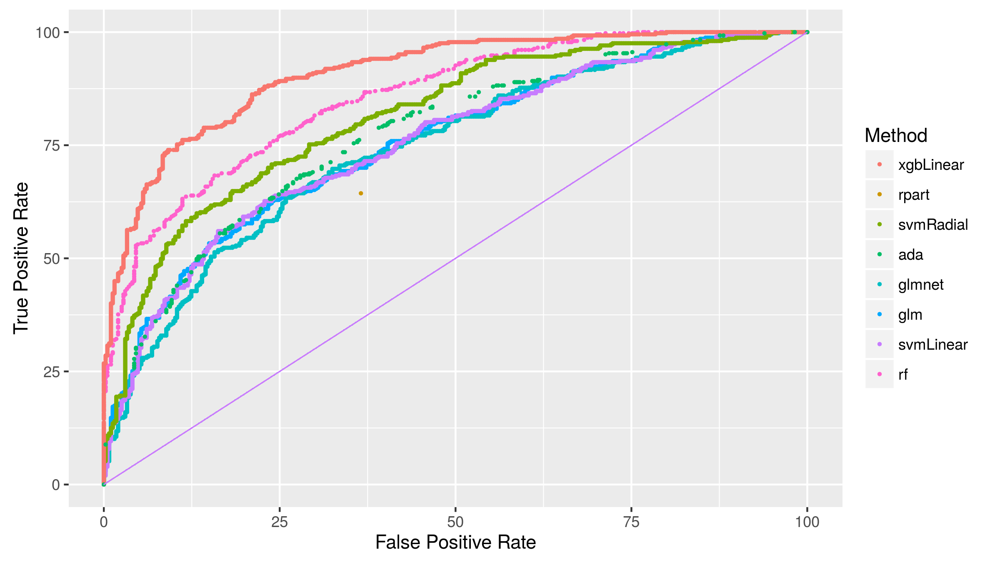
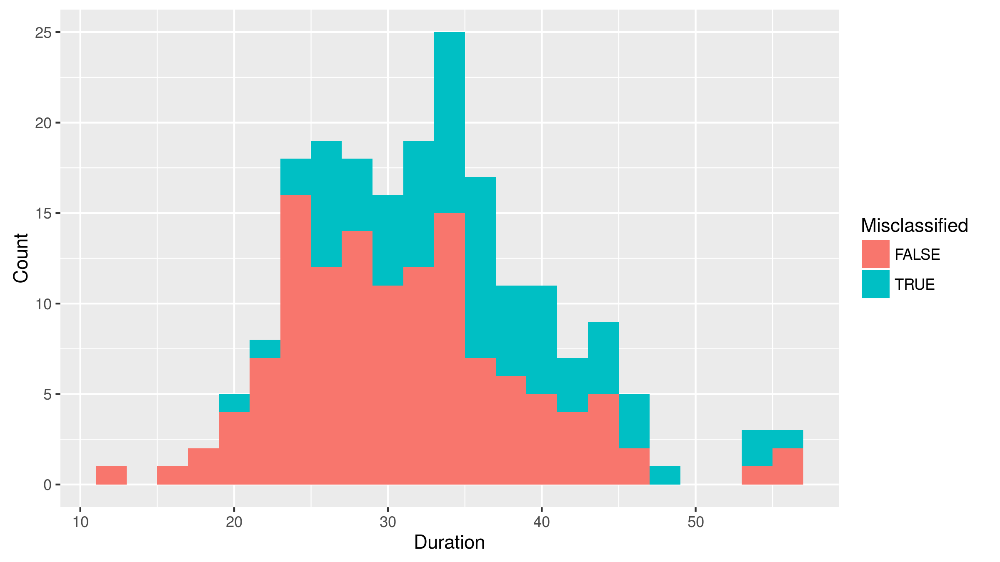

Competitive video games, known as eSports, are becoming big, and League of Legends (LoL) is a leading example. In 2015, the worldwide championship was watched by 36 million people -- and the winning team netted one million dollars. On a daily basis, the game has 27 million unique players with a concurrent players peak of over seven millions. eSport is big.

LoL is in the category of Multiplayer Online Battle Arena (MOBA) games, i.e. video games played online and featuring teams fighting each other. In a match of LoL, two teams of five players compete to destroy each other's castle. Each player controls a character, called champion, with various abilities, while achieving high levels of experience and gaining gold allowing further development of the champion during a match. A team then hopes to develop more quickly to gain the upper hand to destroy the other team's defense and eventually castle.

Below, we present an analysis of games played in order to understand features that enable prediction of the winning team while the game progresses. This can be applied to ensuring fairness of the two teams' composition and development. This can also be applied to betting as the game unfold.

The data was obtained through an API provided by Riot, LoL's parent company. It is given in the form of deeply nested JSON format, which can be access through a package called tidyjson. Fortunately, some documentation is provided in order to help navigate the JSON. However, not all the information advertised is in fact available. The data is composed of a sample of 1000 matches played in early 2016.

## Summoner's Rift

The game unfolds on a map called Summoner's Rift. The team in the lower left corner is the blue team, and the other is the red team. Each of the two teams start in their respective castle, and need to destroy the enemy's defense and reach the castle in the opposite corner before the enemy team does the same. There are three paths connecting the castles, and the zones in between are collectively called the jungle. Most of the early action happens outside of the jungle, as can be seen in the density map below.

The map shows the average density of actions happening in the first 20 minutes for a match in which the red team wins. The action is concentred close to the blue side first line of defense. We do note however that there is some action happening in the jungle near specific points, the dragon and the herald, which we discuss further below.

## Timeline

A typical game has a median length of 32 &plusmn; 5 min, and unfolds as follows. Early in a match (around 3 &plusmn; 1 min), a team will succeed in killing a champion from the other team. A kill means that the target champion will be removed from the match for a certain amount of time, and then returned. There are also three neutral objective that can be killed: the dragon, the herald, and the baron. Trying to take one of them puts the team at risk, but gives a bonus helping to gain the upper hand. 

The first tower destruction usually happens very close to the killing of the dragon for the first time (both happen around 13 &plusmn; 2 min). A typical strategy is to push and destroy a tower, and then go for the dragon while the other team scrambles to defend itself. Another strategy is to secretly kill the dragon, and then use its bonus to push to a nearby tower. The herald is done a little later, around 16 &plusmn; 2 min, as it is harder to do than the dragon.

The 20 minutes mark is important. First, the herald disappears and is replaced by the baron. Second, a team can surrender from this point on. A team typically surrenders around 25 &plusmn; 3 min.

The baron gives a large bonus, and so is usually happening close to the final push to destroy the other castle, around 29 &plusmn; 2 min. At that point the match is well advanced, and a team that would have felt unable to win would have surrendered. Unfortunately, the API does not provide whether a match ended with a surrender. However, if a match ended without the two towers defending the castle as not destroyed, it is possible to conclude that the match must have ended by a team surrendering. This is how we flagged each match as ended in surrender or not. About 20% of the games end as such.

A team usually manage to destroy the enemy's castle in about 33 &plusmn; 5 min. Only in very long matches do champions reach their maximal levels, as it usually takes about 45 &plusmn; 3 min to happen, and this happens in only about 6% of the matches. The timeline below shows the median time for the first of each event discussed.

Given that a team was the first to get a champion kill, the probability of winning are now above 60%. This is an important increase, since the match is probably still within the first five minutes. Being the first to get a tower or a dragon brings the probability near 70%. The first herald brings near 75%. These last events are all within the first 20 minutes of the match. Being the first to get the baron increases the chances to over 80%, but this usually happens late in the match, near 30 minutes as mentioned before.

We summarise the effect of the first objectives in the plot below.

## Prediction

Since the 20 minutes mark is important, we focus on the events that happen in the first 20 minutes, namely the first kill or destruction of a champion, tower, dragon, or herald. Using these features, we can set up a prediction algorithm, and obtain almost 80% accuracy with an algorithm like glmnet.

The ROC curves also give an idea of the quality of the prediction. For instance, we can see that xgbLinear is overfitting our training data by giving a very high AUC for the accuracy it gives.

SVM with radial basis functions performs well. We can look at which match the algorithm misclassifies in duration. As expected, the proportion of missclassified matches increases with the duration of the match.

We can try to push the prediction window down to 10 minutes. 

We can also look at the ROC curves in this case. 

SVM with radial basis functions still performs well. Again, the proportion of missclassified matches increases with the duration of the match.

For future development, we want to focus on earlier events, and even attempt to predict with features set before the match starts. This includes the choices of champions, and some estimation of the level of each player used internally by the game to match players in teams of similar levels. Given the popularity of the game, for any theory of what constitute a winning combination, there is a supporter available online. However, a less argued for feature appears to be the distribution of wards in a match. A ward allows a team to see parts of the map beyond the vision granted by its players. This would make for an interesting element to study.

The codes are available on [github](https://github.com/vincentqb/league-of-legends).